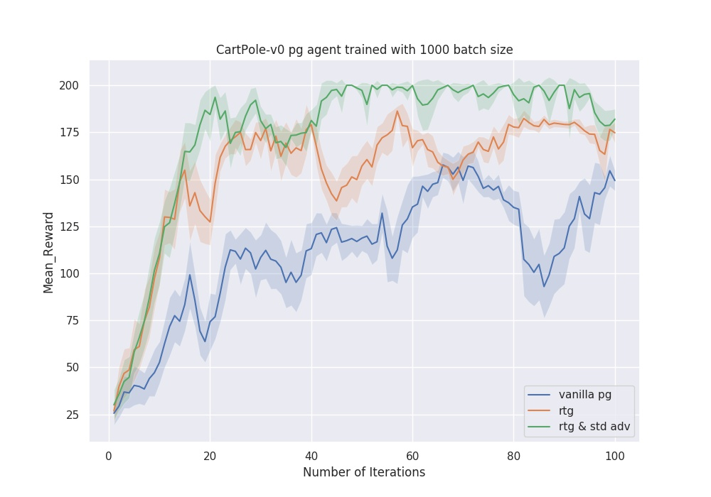

## Setup

You can run this code on your own machine or on Google Colab. 

1. **Local option:** If you choose to run locally, you will need to install MuJoCo and some Python packages; see [installation.md](../hw1/installation.md) from homework 1 for instructions. If you completed this installation for homework 1, you do not need to repeat it.
2. **Colab:** The first few sections of the notebook will install all required dependencies. You can try out the Colab option by clicking the badge below:

## Assignement2 Solutions

### Experiment 1

Policy Gardient Experiments on CartPole-v0 

Three kind of variants are run: 

1.Vanilla Policy Gradient (VPG)
2. VPG with reward-to-go (rtg)
3. VPG with reward-to-go and standardized advantages (rtg & std adv)

Performance of all three variants are averaged over five rollouts and five random seeds

Answers to Questions:

1.Which value estimator has better performance without advantage-standardization: the trajectorycentric one, or the one using reward-to-go?
 
 A: Definitely reward-to-go gives better performance than using entire trajectory for policy update as rtg computes rewards from current time step into the future thus accounting for causlaity

2.Did advantage standardization help?

 A: Advantage standardization did help and it gives slightly better performance over policy gradient with only reward-to-go
 
3.Did the batch size make an impact?

 A: Using large batch size improves the performance of vanilla policy gardient and stabilizes the performance of all three variants

### Experiment 2

Policy Gradient with reward-to-go and standardized advanteges on InvertedPendulum-v2 continuous control task for five rollouts and single seed

### Experiment 3
Experimented with neural-net baseline for policy gradient with rtg & std adv for LunarLanderContinuous-v2 task.
Performance averaged over five rollouts and five random seeds

### Experiment 4
Policy gradient implementation to learn a controller for the HalfCheetah-v2 benchmark environment with an episode length of 150. This is shorter than the default
episode length (1000), which speeds up training significantly. 

First grid search is performed over  batch-sizes b ∈ [10000, 30000, 50000] and learning_rates r ∈ [0.005, 0.01, 0.02]

Best batch-size and learning_rate obtained from previous experiment are used in the second experiment. Performance averaged over five rollouts and five random seeds

## Complete the code

The following files have blanks to be filled with your solutions from homework 1. The relevant sections are marked with "TODO: get this from hw1".

- [infrastructure/rl_trainer.py](cs285/infrastructure/rl_trainer.py)
- [infrastructure/utils.py](cs285/infrastructure/utils.py)
- [policies/MLP_policy.py](cs285/policies/MLP_policy.py)

You will then need to complete the following new files for homework 2. The relevant sections are marked with "TODO".
- [agents/pg_agent.py](cs285/agents/pg_agent.py)
- [policies/MLP_policy.py](cs285/policies/MLP_policy.py)

You will also want to look through [scripts/run_hw2.py](cs285/scripts/run_hw2.py) (if running locally) or [scripts/run_hw2.ipynb](cs285/scripts/run_hw1.2pynb) (if running on Colab), though you will not need to edit this files beyond changing runtime arguments in the Colab notebook.

You will be running your policy gradients implementation in four experiments total, investigating the effects of design decisions like reward-to-go estimators, neural network baselines for variance reduction, and advantage normalization. See the [assignment PDF](cs285_hw2.pdf) for more details.

## Plotting your results

We have provided a snippet that may be used for reading your Tensorboard eventfiles in [scripts/read_results.py](cs285/scripts/read_results.py). Reading these eventfiles and plotting them with [matplotlib](https://matplotlib.org/) or [seaborn](https://seaborn.pydata.org/) will produce the cleanest results for your submission. For debugging purposes, we recommend visualizing the Tensorboard logs using `tensorboard --logdir data`.
